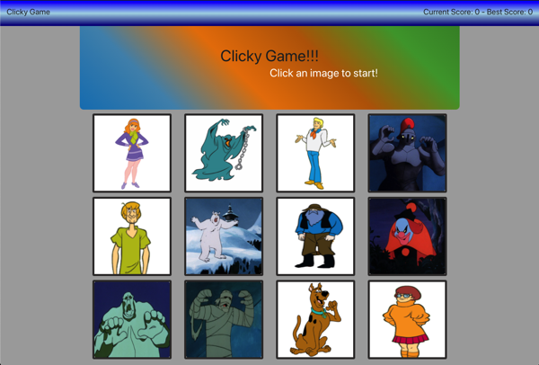

# 
clicky

## Overview

A Scooby-Doo based memory game that uses React to update and moniter the state of the page.

## How to Play

First [click this link](https://niles87.github.io/clicky/ "Clicky Deployed Page") take you to the deployed application. Scroll down to the images and click! Then just follow the prompts until an incorrect guess, after that start all over again!

### Technologies used

- Reactjs
- Bootstrap

### Contributers

**Niles Bingham** - Developer
